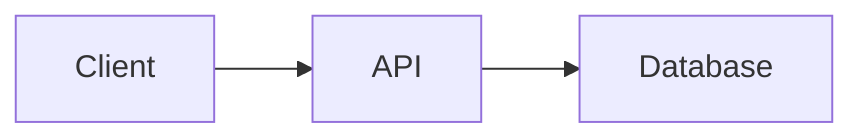

# Platform Diagram Support

This file documents how each target platform handles Mermaid diagrams and what the skill should do for each.

## Rendering matrix

| Platform | Native Mermaid? | Diagram delivery method |
|----------|----------------|------------------------|
| **Dev.to** | Yes | Embed ` ```mermaid ` code block directly in markdown |
| **Hashnode** | Yes | Embed ` ```mermaid ` code block directly in markdown |
| **Viblo** | Yes | Embed ` ```mermaid ` code block directly in markdown |
| **Ghost** | Partial | Default to PNG image. Add a note that Mermaid code blocks work if the user has added Mermaid.js to their Ghost theme via code injection |
| **Medium** | No | Render to PNG, upload as image. Medium uses a rich-text editor — no markdown support |
| **Substack** | No | Render to PNG, upload as image. Substack uses a rich-text editor |
| **Reddit** | No | Render to PNG, host externally (Imgur or own domain), link in self-post body. Reddit self-posts cannot embed inline images. |
| **Facebook** | No | Render to PNG, attach as image to the post |
| **Threads** | No | Render to PNG, attach as image. Keep diagrams very simple — they display small on mobile |

## Delivery rules by platform

### Dev.to / Hashnode / Viblo (native Mermaid)

Embed the diagram as a fenced code block inside the post markdown:

````markdown
Here's how the sync engine works:



The key thing to notice is...
````

No separate image file needed. The platform renders it on publish/preview.

### Ghost (partial support)

Default behavior: render to PNG and include as an image.

If the user confirms their Ghost theme supports Mermaid (via code injection), switch to embedding the Mermaid code block directly. Store this preference in `config.json` under:

```json
{
  "platform": {
    "ghost_mermaid_support": true
  }
}
```

### Medium / Substack (no support)

These platforms have rich-text editors with no markdown rendering. Diagrams must be:

1. Rendered to PNG using the Mermaid MCP tool or CLI
2. Saved as a separate file alongside the post markdown
3. Referenced in the markdown for the user's reference: ``
4. The user manually uploads the PNG when composing their post on the platform

Include a note when delivering: *"Upload the diagram image when you paste the post into [Medium/Substack]."*

### Reddit (no support)

Reddit self-posts cannot embed inline images. Diagrams must be:

1. Rendered to PNG
2. Hosted externally (Imgur is the Reddit convention, or the user's own domain)
3. Linked in the self-post: `[Diagram: Description](https://i.imgur.com/xxxxx.png)`

For visual-heavy posts, the skill should note that a link post (pointing to the full blog where diagrams render natively) may work better than a self-post with linked images.

### Facebook / Threads (no support)

Social platforms — diagrams are image attachments.

1. Render to PNG
2. Save alongside the post text file
3. Note in the delivery: *"Attach the diagram image when posting."*

**Threads-specific:** Diagrams should be very simple (under 6 nodes) because they display on mobile. If the diagram is complex, suggest the user skip it for Threads or link to the full blog post instead.

**Facebook-specific:** Medium-complexity diagrams work fine as Facebook supports image viewing. But keep in mind Facebook compresses images — use clean, high-contrast diagrams.

## Cross-platform bundle handling

When generating a cross-platform bundle (blog + social versions of the same post):

1. **Blog version (Dev.to/Hashnode/Viblo):** Embed Mermaid code block
2. **Blog version (Medium/Substack/Ghost):** Include PNG + Mermaid source file
3. **Reddit version:** Include PNG links (hosted externally). If the post has multiple diagrams, consider recommending a link post to the blog instead.
4. **Facebook version:** Include PNG if the diagram is simple enough for social. Otherwise, omit and let the full blog post carry the visual.
5. **Threads version:** Omit diagrams unless extremely simple. Reference the blog post for visuals.

Don't generate PNG files for platforms that render Mermaid natively. Only render when needed.

## Mermaid source preservation

Always preserve the Mermaid source code so the user can edit diagrams later:

- **Native Mermaid platforms:** The source is already in the markdown — no extra file needed.
- **PNG platforms:** Save a companion `.mermaid` file alongside the PNG:
  - `post-slug-diagram-1.png` (rendered image)
  - `post-slug-diagram-1.mermaid` (editable source)
- **Cross-platform bundles:** One `.mermaid` source file shared across all versions.
